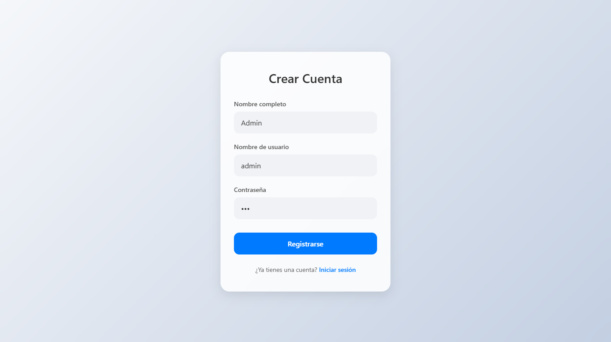
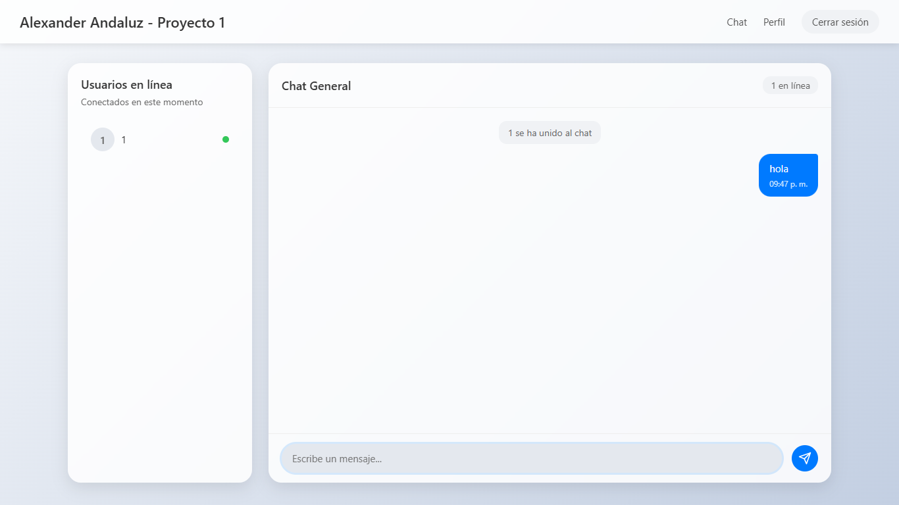
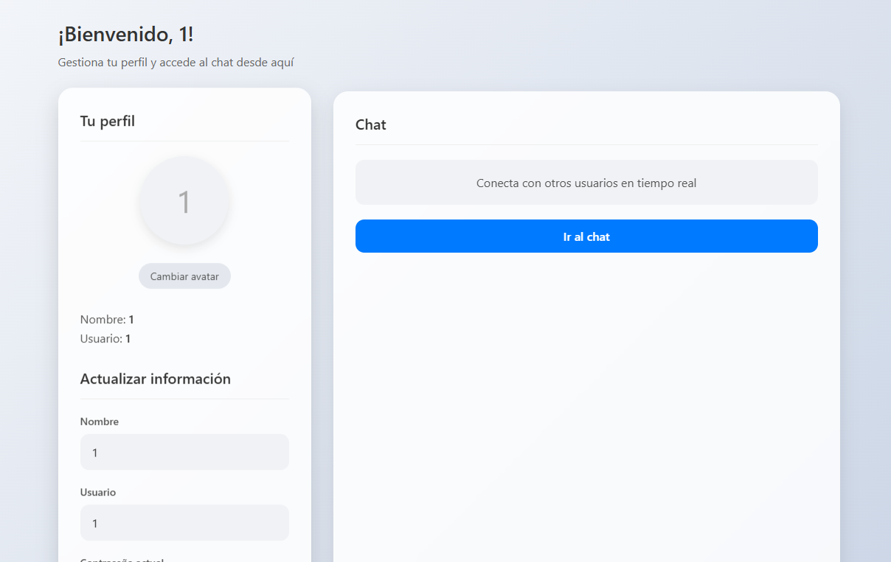
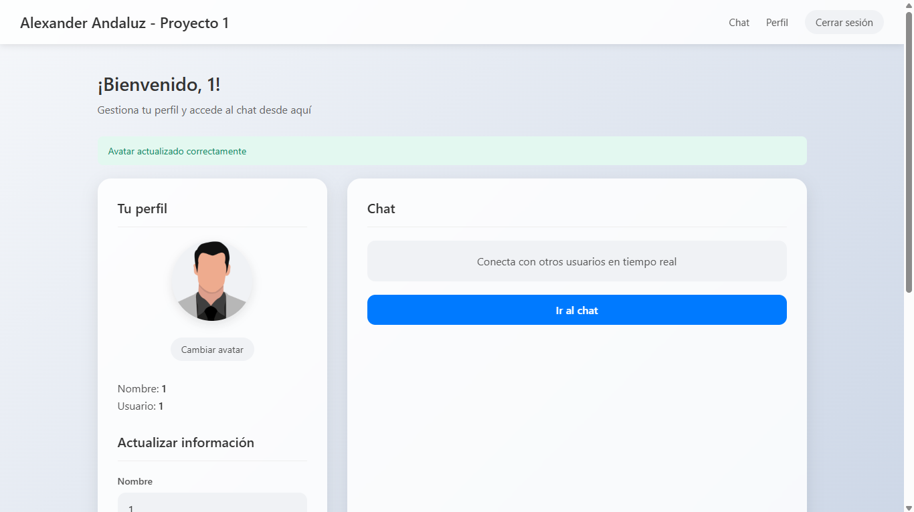

## Screenshots/ Capturas de Pantalla

### Registro

### Chat

### Perfil

### Cambiar Avatar

# Flask Chat App / Aplicación de Chat con Flask

A simple and aesthetic web app built with Flask. It includes real-time chat, user authentication, and encryption for security.  
Una aplicación web estética y funcional hecha con Flask. Incluye chat en tiempo real, autenticación de usuarios y encriptación para mayor seguridad.

## Features / Características
- Real-time chat using Socket.IO  
  Chat en tiempo real usando Socket.IO  
- User login with hashed passwords  
  Inicio de sesión con contraseñas encriptadas  
- Avatar support  
  Soporte para avatares  
- Clean and modern UI  
  Interfaz limpia y moderna

## Tech Stack / Tecnologías Usadas
- Python (Flask, Flask-SocketIO, Flask-Login)  
- HTML / CSS / JavaScript
